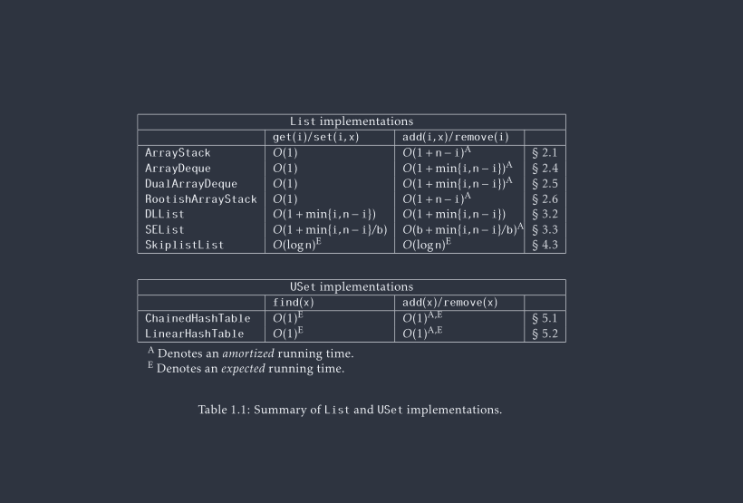

# Vocabulary 
- **Correctness**: the DS should correctly implement its interface.
- **Time Complexity:** The running times of operations on the data structure should be as small as possible
- **Space complexity:** The DS should use as little memroy as possible

*Runtimes*
- **Worst-case running times:** These are the strongest kind of running time guarantees.
- **Amortized running times:** This is the cost of a typical operation
	* Some individual operations may take more than f(N) for example but the average, over the entire sequence 	    of operations is at most f(n)

*Summary of List Implementations*

