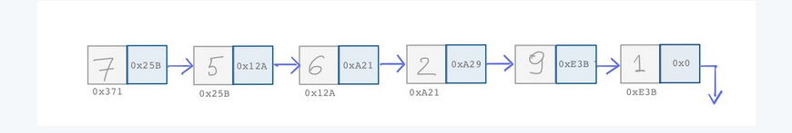
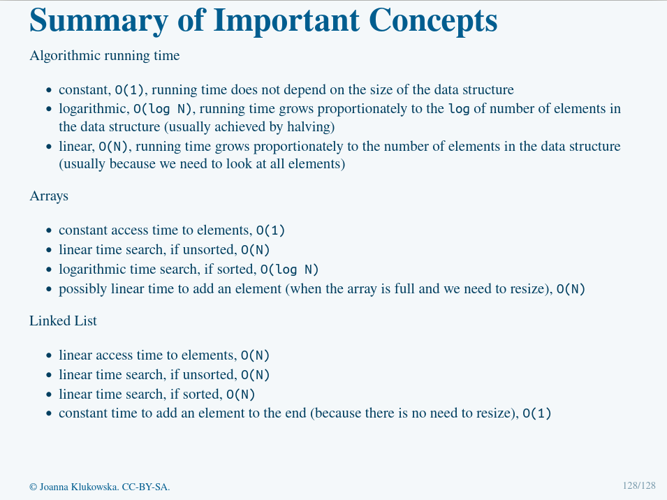

# Data Structures and Algorithms (Bird's Eye View)
**Linear** - When the number of operations is directly proportional to the input size (generally denoted as N), we are using a linear 
algorithm. This is often described as an O(N) algorithm


## Power of Halving
The significant performance improvement in some algorithms come from halving the number of solutions (pages in the phonebook search example)

**Logarithmic** - When the search space decreases by half after each comparison, the algorithm is said to be logarithmic.
It is growing proportionally to the logarithm of the input size *N*. Such an algorithm is said to be O(log N). 

## An Array as the First Data Structure
**array** - because an array occupies contiguous memory locations, the access to indvidiual elements is instantaneous

note: it does not matter how the large the array is, or at which index you are accessing from. As long as you give the specific index
it will be accessed instantaneously

**constant** - when an operation is independent of the number of eleements in the data structure, it is said to be constant, which is denoted as O(1)

### Searching Arrays

- if the data is not sorted -> we use linear search O(N)
- if the data is sorted -> we use binary search O(log N)

### Adding Elements
When elements are added to an array, the array has a set max size, thus it can be tedious 
to add to an array and you may have to create a new array altogether
- Add operations are fast (in constant time as well)


Alternatively, we could put elements/vars anywhere in memory instead of continguous locations
But then, how do we know which element is at which index???? Or which element follows which
	- Thus we need some way to connect these elements, such as **pointers**
	- Storing the pointers (memory locations of the following value) allows us to jump from element to the following element
		* perserving order while storing memory anywhere
		* the final element points to 0x0 to denote the end of the "array"
	- Now when adding, we just change the memory address of the pointers (making storage less tedious)

## Linked List
**Linked List** - a linear collection of data elements in which each element points to the next one         
[Reference Slide](https://cs.nyu.edu/~joannakl/cs102_s22/slides/03-data_structures_overview_1.html#101)


The list is usually composed of nodes (containing the actual value of the data) and the memory address of the next element

```java 
class Node {
	int data;
	Node next;
}
```

A linked list may also include references to a node such as....
**head** is a reference to the first node
**tail** is a reference to the second node

References that do not point to anything are set to 0x0 (or zero) which is often described as null

## Adding to a Linked List
1. create a new node (set its value)
2. create a new next node pointing to null
3. if tail points to a node, set *tail.next* to the newly created node
	- assign tail to the newly created node
4. Otherwise, the list is empty and we set tail and head tot the newly created node


Adding to the end of a linked list does not dpeend on the number of elements that are already in that list.
This is a constant time algorithm O(1).

**Accessing Elements**
In order to access elements in a linked list, we must start at the head reference and follow nodes from there (linearly)

*Thus a linear list has*
- linear access time to elements O(N)
- linear time search, if unsorted, O(N)
- linear time search, if sorted, O(N)
- constant time to add an element to the end O(1)


--------------------------------------
## Stacks 

Stack - linear structure in which the elements can be added to and removed from only one end
	- LIFO (last in first out data structure)

Stack Operations:
- push - adds an element to the top of the stack
- pop - removes an element from the top of the stack
- top - return the element from the top of the stack

*We can implement stacks with arrays & linked lists*


## Queues
Queue - linear structure in which the elements can be added at the back (one end of the Qu) and removed from the front
	- FIFO 
	  
Queue Operations:
- enqueue - adds an element to the end/back of Q
- dequeue - removes element from the front of the Q
- font - returns element at front of the Q
		
## Binary Search Trees

```java 
// A different kind of node
class Node {
	int data;
	Node left;
	Node right;
}
```

In order to create a tree like data strucutre, we must use a node like this
Binary Search Tree - a DS that starts with a special root element in wchich all values stored to the left of the root element are smaller than it 
	and all values stored to the left are larger

note: after some balancing, we can implement Bsearch trees to guarantee O(log N) performance


## Hash Tables
*A really efficient method is to have a mapping from the actual data to the location in memory where that data is stored.*
- allows fast look-ups based on some characteristic of data 
- O(1) performance of all operations (hard to implement)


