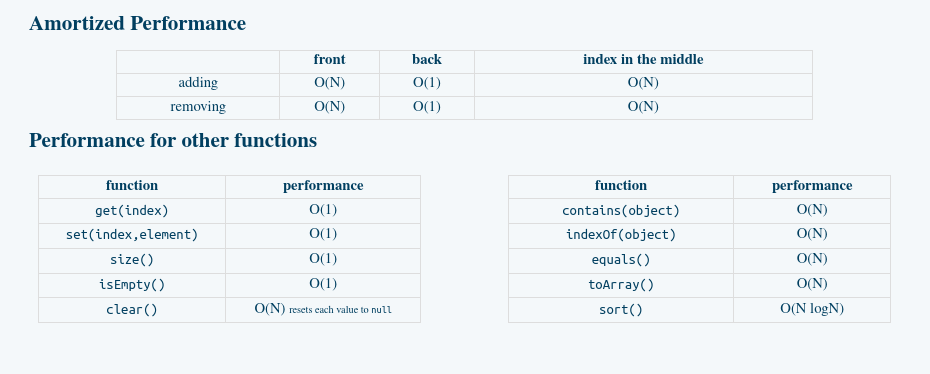

# Lists Lecture I, II, & III

**abstraction** - process where general rules and concepts are derived from generalization of specific examples
	* In CS, its the process of hiding details of implementation in programs and data (security/relevance)
	
**abstract data type** - the specification of a data type (a set of values and operations on those values)
	* implementation independent
	* can be either programming language dependent or independent

**List ADT**
- values stored
	* the list of elements itself
	* size - curr numbers of elements in the list
- operations: 
  	- add
	- remove
	- find
	- get
	- size
	- clear

## Linked Lists: Nodes
A LinkedList is a DS that stores elements in sequential order 
- elements can be stored anywhere >> "unlimited" memory
- can store any type of element and in Java's version, all types

```java
class Node {
	int data;
	Node next;
}
// we can also store any ref type in these nodes

// a node can store any reference data type
// Node<String> n = new NOde<String>();
class Node <E> {
	E data;
	Node<E> next
}

```
**Iterating Through a List**
```java
// choose starting/reference point
Node current = head;
// change memory address of our reference point (current), storing the memory address
// of the next node to which the node points
current = current.next;

while (current != null) {
	current = current.next;
	// we iterate through the entire list (node to node)
	// this method goes through the list and falls off at the end
}

if (current != null) {
	while (current.next != null) {
		current = current.next;
		// iterating through the entire list and stopping at the end
	}
}
```

**Adding to a LinkedList**
```java
Node n = new Node();
```

## LinkedList: Operations
- *note:* We must make sure our algorithm works with an empty list, singular list, or many elements
	* in an empty list the tail & head point to null
- add to front
	* when adding to an empty list, both tail & head must point to the element which points to null
- add to back
- add elsewhere


```java
// making a new list (from empty list)
Node curr = new Node();
head = curr;
tail = curr;

// adding to the front of a list
Node n = new Node();
// point our new node to the head (so we do no lose any data when adding)
n.next = head;
// remove the old head/assign the new node 
head = n;


// adding to the end of a list
Node n = new Node();
// point the tail to the next value N
tail.next = n;
// make the tail to its own pointer (signifying the end)
tail = tail.next;
```

```java
// adding to an arbitrary position
Node n = new Node();
Node current = head;
// traverse/advance the current node to before the position at which you want to add
// this is usually done with a counting function (when adding by index)
// or just by checking equivalence (if by value)
n.next = current.next;
current.next = n;
```


```java
// finding an element in a LL
public int find (E it) {
	// since we must traverse the entire list to find the element with or w/o the index
	// we use a counter to denote our position
	int counter = 0;
	// point a reference node to the head
	Node <E> current = head;
	// begin traversing until we hit null or the value is found
	while (current != null &&
			!current.data.equals(it) {
			current = current.next;
			counter++;
			}
	// we add to the counter as we traverse
	// returning the counter number if found
	// else returning -1
	if (current == null)
		return -1;
	return counter;
}
```

```java
// removing from the front
// we just point to the next value
head = head.next;
// for the single element deleted from a singular element LL, we must account 
// for the tail
if (head == null) 
	tail = null;
	

// BELOW IS REMOVAL FOR ARBITRARY POSITIONS AND THE TAIL
// removing the last node, we must traverse to the end
// since we do not know of the memory address of the last node
// we must traverse til current=penultimate tail, then set that to null
current.next = null;
// we also have to deal with the original tail pointer 
tail = current;
// and if the element is the last one 
if (head.next == null) {
	head = null;
	tail = null;
}
```

## ArrayList<E>

This is an array based implementation of a list within Java.
- data is stored in an array (not nodes)
- can store any type of data & tons of operations
- ArrayLists unlike normal arrays can grow?

- The main difference between LL nad ArrayLists are how they are accessed, nodes vs arrays, and size to add
  when the array is completely full
```java 
public boolean add(E element) {
	if (size >= array.length) {
		E[] bigger (E[]) new Object[array.length * 2]; // creates a "bigger" array to copy the smaller arr into
		System.arraycopy(array, 0, bigger, 0, array.length); // this causes the add function to be O(N)
		array = bigger;
	}
	array[size] = element;
	size++;
	return true;
}
```


**Amortized Analysis**
- Interested in the performance of a given operation on average - when we repeat the operation many times and 
  calculate how much time it took divided by the number of repeats.
  	+ **Appending** In the case of appending to ArrayList, it has amortized time of O(1), constant, because, as long as
	  the array size is increased by a multiplicative factor, not an additive factor. (this is 2 in the above case)
	+ This can only occur (instead of an amortized time of O(N), linear) because
	  of the multiplicated factor

*Adding to an Arbitrary Position* -> O(N): shift the elements by one position to the right (higher indexes)
*Removing from an Arbitrary Position* -> O(N): shift the elements by one position to the left (lower indexes)

### Equals Method in ArrayList
**public boolean equals (Object o)**
Compares the specified object with this list for equality. Returns true if and only if 
the specified object is also a list, has the same size, and the same order
**Implementation Requirements:** 
1. check if specified object is this type of List (ArrayList or LL), return false if not
2. iterate over each list, comparing corresponding elements, return false if any do not match
3. If one iteration finishes before the other return false
4. otherwise return trtue
**Parameters:** o - the object to be compared for equality with this list
**Returns:** true if object is equal to this list

note: the wording between this list and specified object may be weird
  but it accounts for the fact that we can compare/use the the equals method on
  an instance of AL and instance of LL to compare them

***EQUALS* METHOD IMPLEMENTATION**


### ArrayList<E> Summary
- capaacity = size of the array used to store data
- size = number of element stored
$$ 
Capacity >= Size 
$$
- An empty list will often have a non-zero capacity
- Capacity is not decreased as elements are removed. But it can be reduced by an explicit call to *trimToSize*

*note:* Adding/Removing have the amortized performance


## Singly Linked List
- reference from a node to a node that follows, and the last node's reference is set to null
- thus only one link between two values (maybe two values)
**DOUBLY LINKED LIST** - double connection between nodes, meaning that each node has a reference
  to the node ahead of it and behind it.
```java 
// works like singly, but double the references to store/keep track of
// some operations like removing the tail become more efficient 
class Node<E> {
	E data;
	Node<E> next;
	Node<E> prev;
}
// LinkedList<E> class uses the doubly linked list
```

**CIRCULAR LINKED LIST** - the last node is connected back to the first node (instead of having its reference set to null).
  which, can be either singly or doubly linked. so instead of pointing to null, our tail node should point to the end.
  this can also be doubly linked, such that the head node also points to the tail node
  
## Iterators
An **iterator** is an object that allows us to traverse a collection (DS) and visit each element exactly once. 

In order to make the iteration of our DS efficient and used properly we must create an iterator for our specific DS. 
This helps as it stops the DS from being traversed multiple times, or plain-incorrectly (such as reusing get() in an iterator, which
makes an O(N) time into O($N^2$)). Thus, we must satisfy the interator interface.

```java 
private class Its implements Iterator<E> {
	private Node<E> current = head;
	
	public boolean hasNext() {
		reutnr current != null;
	}
	
	public E next() {
		E tmp = current.data;
		current = current.next;
		return tmp;
	}
}
// we must then add the following method to the List object, to make it iterable
// this is already done with both LinkedList and ArrayList
public Iterator<E> iterator() {
	return new Itr();
}
```


